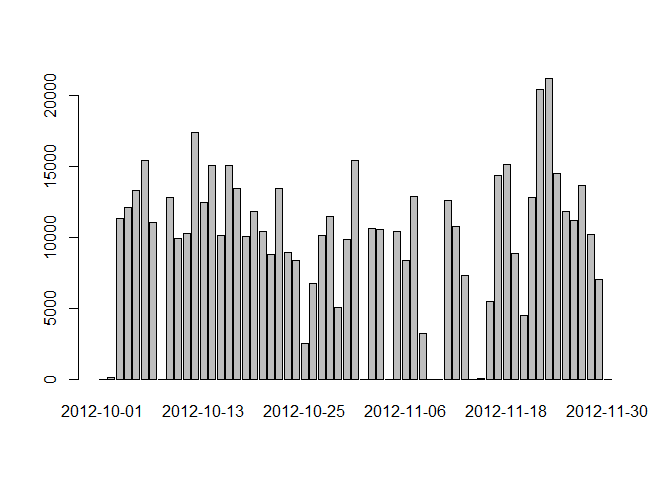
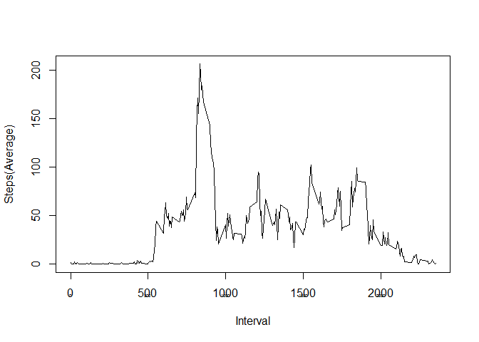
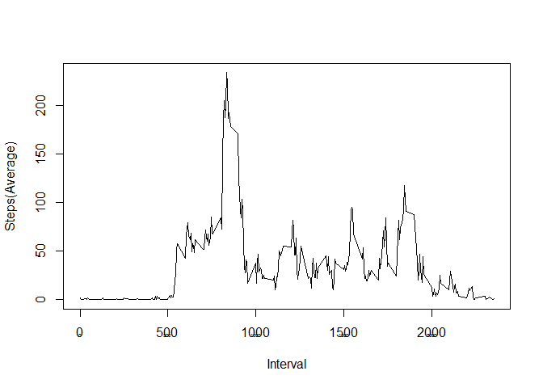
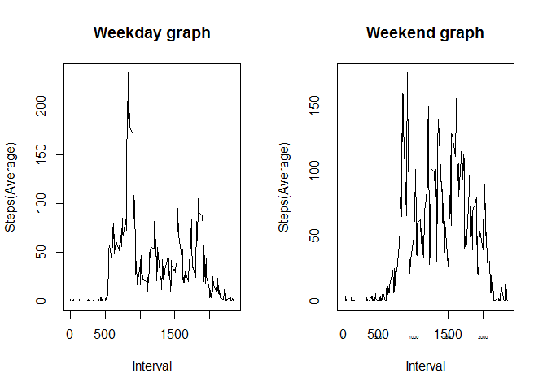

# Reproducible Research: Peer Assessment 1


## Loading and preprocessing the data

```r
setwd("F:\\temp\\repdata-data-activity");
activitydat <- read.csv("activity.csv", stringsAsFactors=FALSE);
print(head(activitydat));
```

```
##   steps       date interval
## 1    NA 2012-10-01        0
## 2    NA 2012-10-01        5
## 3    NA 2012-10-01       10
## 4    NA 2012-10-01       15
## 5    NA 2012-10-01       20
## 6    NA 2012-10-01       25
```


## What is mean total number of steps taken per day?

```r
activitydaytotal <- aggregate(activitydat[,1], list(activitydat$date), sum, na.rm=TRUE);
names(activitydaytotal) =  c("Date","Steps");
barplot(activitydaytotal$Steps, names.arg=activitydaytotal$Date, plot=TRUE);
```

 

```r
library(xtable);
summary <- data.frame(c("Mean", "Median"), c(mean(activitydaytotal$Steps, na.rm=TRUE), median(activitydaytotal$Steps, na.rm=TRUE)));
names(summary) <- c("    Stat    ", "    Value    ");
xt<-xtable(summary);
print(xt, type="html")
```

<!-- html table generated in R 3.1.2 by xtable 1.7-4 package -->
<!-- Mon Jan 19 05:55:35 2015 -->
<table border=1>
<tr> <th>  </th> <th>     Stat     </th> <th>     Value     </th>  </tr>
  <tr> <td align="right"> 1 </td> <td> Mean </td> <td align="right"> 9354.23 </td> </tr>
  <tr> <td align="right"> 2 </td> <td> Median </td> <td align="right"> 10395.00 </td> </tr>
   </table>

## What is the average daily activity pattern?

```r
activityintervalmean <- aggregate(activitydat[,1], list(activitydat$interval), mean, na.rm=TRUE);
names(activityintervalmean) =  c("Interval","Steps");
plot(activityintervalmean$Interval, activityintervalmean$Steps, type = "l", xlab="Interval", ylab= "Steps(Average)");
axis(side=1, cex.axis=0.35)
```

 

### 5 minute Interval with the highest number of steps

```r
activityintervalmean$Interval[activityintervalmean$Steps==max(activityintervalmean$Steps)]
```

[1] 835

## Inputing missing values

### Number of records with missing values is 

```r
sum(is.na(activitydat$steps));
```

[1] 2304
All NA values are replaced using the average for that time interval
  
### Replace all the NA values with intereval mean. Count NA values again

```r
activitydaymean <- aggregate(activitydat[,1], list(activitydat$date), mean, na.rm=TRUE);
activitydaymean$x[is.nan(activitydaymean$x)] <- 0;
library(dclone);
```

```
## Loading required package: coda
## Loading required package: lattice
## Loading required package: parallel
## dclone 2.0-0 	 2013-09-27
```

```r
activitydat1 <- dclone(activitydat);
sum(is.na(activitydat1$steps));
```

[1] 2304

```r
for(i in which(is.na(activitydat[, 1]))){ activitydat1[i,1] = activityintervalmean$Steps[which(activityintervalmean$Interval==activitydat[i, 3])] };
print("New count of NA values in data after replacement of NA's with mean")
```

[1] "New count of NA values in data after replacement of NA's with mean"

```r
sum(is.na(activitydat1$steps));
```

[1] 0

### Plot Histogram, Calculate mean, median again after replacing NA's with interval mean

```r
activitydaytotal1 <- aggregate(activitydat1[,1], list(activitydat1$date), sum, na.rm=TRUE);
names(activitydaytotal1) =  c("Date","Steps");
barplot(activitydaytotal1$Steps, names.arg=activitydaytotal1$Date, plot=TRUE);
```

 

```r
library(xtable);
summary1 <- data.frame(c("Mean", "Median"), c(mean(activitydaytotal1$Steps, na.rm=TRUE), median(activitydaytotal1$Steps, na.rm=TRUE)));
names(summary1) <- c("     Stat1    ", "    Value1    ");
xt1<-xtable(summary1);
print(xt1, type="html")
```

<!-- html table generated in R 3.1.2 by xtable 1.7-4 package -->
<!-- Mon Jan 19 05:55:38 2015 -->
<table border=1>
<tr> <th>  </th> <th>      Stat1     </th> <th>     Value1     </th>  </tr>
  <tr> <td align="right"> 1 </td> <td> Mean </td> <td align="right"> 10766.19 </td> </tr>
  <tr> <td align="right"> 2 </td> <td> Median </td> <td align="right"> 10766.19 </td> </tr>
   </table>

## Are there differences in activity patterns between weekdays and weekends?

```r
activitydat["weekday"] <- sapply(activitydat$date, function(x){ day <- weekdays(as.Date(x)); if(day == "Saturday" || day == "Sunday")  "WEEKEND" else "WEEKDAY"});
activitydatWD <- subset(activitydat, activitydat$weekday == "WEEKDAY");
activityintervalmeanWD <- aggregate(activitydatWD[,1], list(activitydatWD$interval), mean, na.rm=TRUE);
names(activityintervalmeanWD) =  c("Interval","Steps");
print("Week day graph");
```

[1] "Week day graph"

```r
plot(activityintervalmeanWD$Interval, activityintervalmeanWD$Steps, type = "l", xlab="Interval", ylab= "Steps(Average)");
axis(side=1, cex.axis=0.35)
```

 

```r
activitydatWE <- subset(activitydat, activitydat$weekday == "WEEKEND");
activityintervalmeanWE <- aggregate(activitydatWE[,1], list(activitydatWE$interval), mean, na.rm=TRUE);
names(activityintervalmeanWE) =  c("Interval","Steps");
par(mfrow=c(1,2)) 

print("Week day graph");
```

[1] "Week day graph"

```r
plot(activityintervalmeanWD$Interval, activityintervalmeanWD$Steps, type = "l", xlab="Interval", ylab= "Steps(Average)", main="Weekday graph");

print("Week end graph");
```

[1] "Week end graph"

```r
plot(activityintervalmeanWE$Interval, activityintervalmeanWE$Steps, type = "l", xlab="Interval", ylab= "Steps(Average)", main="Weekend graph");

axis(side=1, cex.axis=0.35)
```

 

#### Week end graph looks different from week day graph
